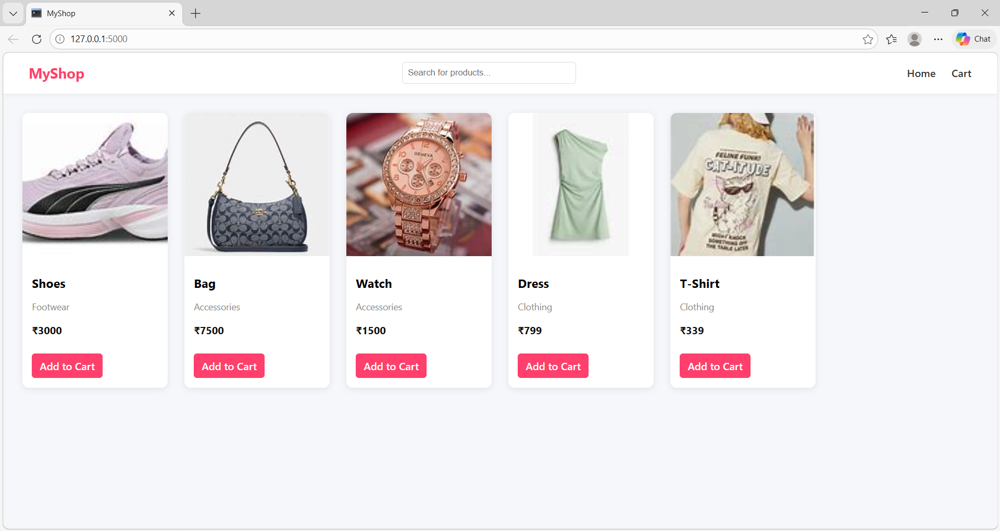

🛒 MyShop - E-commerce Website

A simple eCommerce website built using Flask with product listing, cart system, and Stripe payment integration.

🚀 Features

- View products (Shoes, Bag, Watch, Dress, T-Shirt)
- Add items to cart
- Cart page with selected items
- Checkout system
- Stripe payment integration
- Clean and responsive UI

🛠️ Technologies Used

- Python (Flask)
- HTML, CSS
- Stripe API

📁 Project Structure

MyShop/
│
├── main.py
├── templates/
│   ├── index.html
│   ├── cart.html
│   ├── checkout.html
│
├── static/
│   ├── style.css
│   └── images/

⚙️ Setup Instructions

Install dependencies:
pip install Flask stripe

Add your Stripe key in main.py:
stripe.api_key = "your_secret_key"

Run the app:
python main.py

Open in browser:
http://127.0.0.1:5000

💳 Payment

Stripe test mode is used for payment.

📸 Screenshots

